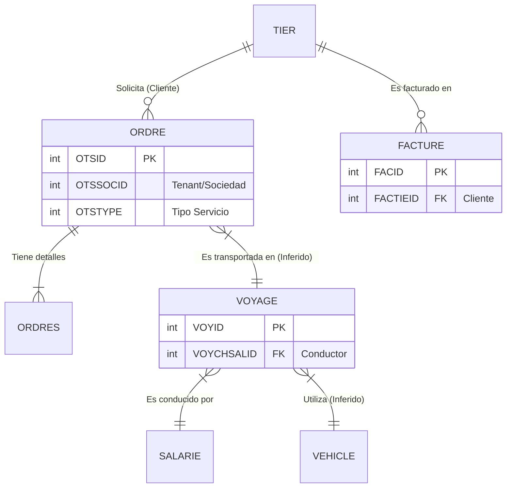

# Informe de Análisis de Producto: TMS Legacy v1.0

> **Versión:** 1.0
> **Fecha:** 2026-01-11
> **Objetivo:** Radiografía técnica y funcional para la migración a TMS 2.0
> **Autor:** Senior Solutions Architect (Agentic AI)

## 1. Resumen Ejecutivo
El sistema actual es un TMS monolítico basado en tecnología web legacy (ASP), con una arquitectura de base de datos relacional robusta pero acoplada. La lógica de negocio reside fuertemente en procedimientos almacenados o consultas SQL complejas incrustadas en la capa de presentación. La seguridad y segregación de datos se manejan mediante el campo `SOCID` (Sociedad ID).

## 2. Diccionario de Entidades Detectadas

A través de la inspección SQL, se han identificado las siguientes tablas "Core" del sistema:

### A. Tráfico y Expediciones
*   **`ORDRE` (Cabecera de Expedición):** Entidad principal que gobierna el flujo de transporte.
    *   **Identificadores:** `OTSID` (PK), `OTSSOCID` (Sociedad).
    *   **Estados:** `OTSETTNIV` (Nivel de estado, ej. >= 4 para activas).
    *   **Tipología:** `OTSTYPE` (2 = Expedición Estándar).
    *   **Datos Clave:** `OTSDEPDTDEB` (Fecha Salida Preferente).
*   **`ORDRES` (Detalles/Seguimiento):** Extensión de la expedición, posiblemente conteniendo datos de segmentos o "Misiones". Vinculada por `OSROTSID = OTSID`.

### B. Planificación y Recursos
*   **`VOYAGE` (Viaje/Ruta):** Agrupador logístico de expediciones.
    *   **Identificadores:** `VOYID` (PK), `VOYSOCID`.
    *   **Tipología:** `VOYTYPE` (2, 3, 4, 5 = Diferentes modos de transporte/fases).
    *   **Recursos:** `VOYCHSALID` (FK a Conductor/Salarié).
*   **`SALARIE` (Empleado/Conductor):** Maestro de conductores y personal.
    *   **Identificadores:** `SALID` (PK).
    *   **Relación:** `LEFT JOIN` desde `VOYAGE` para obtener nombres y datos del conductor.

### C. Financiero y Terceros
*   **`FACTURE` (Factura de Venta):** Documento fiscal de ingresos.
    *   **Identificadores:** `FACID` (PK), `FACNUM` (Número legal).
    *   **Relación:** Vincula con `TIER` por `FACTIEID`.
    *   **Tipología:** `FACTYPE = 2` (Factura de Venta Directa).
*   **`TIER` (Tercero):** Maestro único de entidades (Clientes, Proveedores, Agencias).
    *   **Identificadores:** `TIEID` (PK).
    *   **Uso:** Centraliza toda la información de direcciones y fiscalidad.

## 3. Mapa de Relaciones (Inferido)

## 4. Hallazgos de SQL y Capa de Datos

### Patrones de Diseño
1.  **Segregación Lógica (Multi-tenant):**
    *   Todas las consultas críticas incluyen la cláusula: `AND (SOCID IN (1) OR SOCID IS NULL)`. Esto confirma una arquitectura donde múltiples empresas conviven en la misma tabla, filtradas por código de sociedad.
2.  **Uso de Join Implícito (Legacy):**
    *   En `Expediciones`, se observa `FROM ORDRE, ORDRES WHERE OSROTSID = OTSID` (sintaxis ANSI-89) en lugar de `INNER JOIN`. Esto denota código antiguo que podría ser menos eficiente en motores modernos si no se optimiza el plan de ejecución.
3.  **Filtrado por "Magic Numbers":**
    *   Estados y Tipos se manejan con literales numéricos (`OTSETTNIV >= 4`, `VOYTYPE IN (2,3,4,5)`). **Recomendación v2.0:** Migrar a Enums o tablas de Estado maestras para mayor legibilidad.
4.  **Selección Indiscriminada:**
    *   Uso extensivo de `SELECT *`. **Riesgo v2.0:** Oneroso para el ancho de banda y memoria. La nueva versión debe implementar DTOs o proyecciones específicas (GraphQL o REST con campos selectivos).

## 5. Análisis Funcional y UX/UI

### Flujos de Proceso Detectados
1.  **Ciclo de Vida del Pedido:**
    *   *Entrada* (Manual/EDI) -> *Planificación* (Asignación a Viaje) -> *Ejecución* (Misiones Carga/Descarga + Eventos) -> *Cierre* (Validación) -> *Facturación*.
2.  **Gestión de Estados:**
    *   La UI utiliza una combinación compleja de pestañas y modales. El usuario pierde contexto al entrar en un detalle (pantalla completa o popup pesado).
    *   **Fricción UX:** La necesidad de cambiar de "Módulo" (de Tráfico a Planificación) para gestionar un flujo continuo genera cortes cognitivos.

### Oportunidades de Mejora (v2.0)
*   **Unificación de Vistas:** Crear un "Centro de Control" donde Expedición y Viaje se visualicen conjuntamente (Gantt o Tablero Kanban).
*   **Búsqueda Global:** Reemplazar los filtros de fecha rígidos (`BETWEEN dates`) por un motor de búsqueda elástica (ElasticSearch o similar) para "Google-like search" de expediciones.
*   **API First:** Desacoplar el frontend de las consultas SQL directas. Crear una capa API intermedia que abstraiga la lógica de `SOCID` y Estados.

## 6. Conclusión
El sistema actual es funcional y rico en datos, pero tecnológicamente deuda. La migración a v2.0 debe priorizar:
1.  **Limpieza de Queries:** Modernizar los JOINS y eliminar `SELECT *`.
2.  **Normalización de Estados:** Documentar y posiblemente refactorizar los "Magic Numbers" de estados.
3.  **Experiencia de Usuario:** Migrar de un enfoque "basado en tablas" a un enfoque "basado en procesos/tareas".
