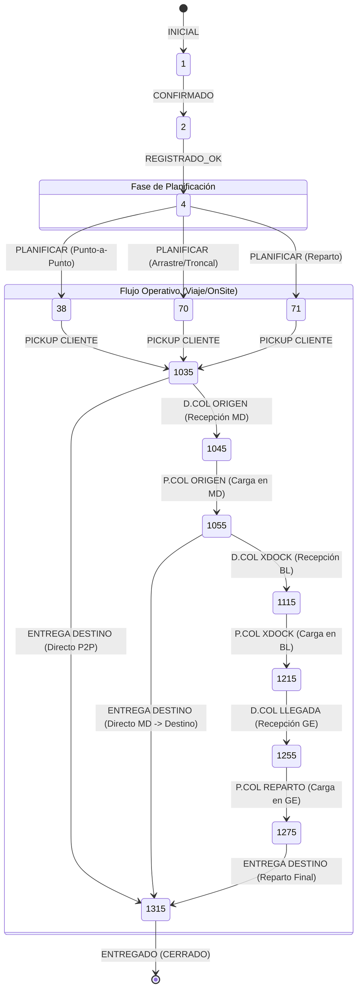

# Análisis del Flujo de Estados OnSite (Proyecto LUIS SIMOES - LS)

Este documento presenta el análisis técnico y la propuesta de configuración para el nuevo flujo de distribución **OnSite** en el entorno de LUIS SIMOES (LS). El diseño aborda la naturaleza de LS como **Carrier (Transportista)** y resuelve los 3 flujos operativos definidos (Cross-Docking, Directo Almacén de Origen y Directo Cliente-Destino).

---

## 1. Mapeo de Flujos OnSite a Estados Existentes en LS

A partir de la ingeniería inversa realizada en la base de datos de LUIS SIMOES, hemos confirmado que la tabla `EstadoPedido` **ya cuenta con los estados necesarios** para soportar el flujo OnSite. 

A continuación, se detalla la equivalencia exacta entre las operaciones físicas del diagrama de flujo y los códigos nativos de LS:

### Flujo 1: Cadena de Cross-Docking (Multietapa)

| Paso Físico | Operación | Nodo | Estado Pedido/Orden | Código LS | Estado Parada | Código Parada |
| :--- | :--- | :--- | :--- | :---: | :--- | :---: |
| **1.1** | Pickup Cliente | Cliente (#1) | `RECOLECTADO EN CLIENTE` | **1035** | `RECOLECTADO EN CLIENTE` | **35** |
| **1.2** | Descarga en MD | MD (#2) | `ENTREGADO EN COL SALIDA` | **1045** | `ENTREGADO EN COL SALIDA` | **45** |
| **1.3a** | Carga en MD | MD (#2) | `RECOLECTADO EN DELEG ORIGEN` | **1055** | `RECOLECTADO EN DELEG ORIGEN` | **55** |
| **1.3b** | Descarga en BL | BL (#3) | `ENTREGADO EN COL CROSSDOCK` | **1115** | `ENTREGADO EN DELEG CROSSDOCK` | **115** |
| **1.4a** | Carga en BL | BL (#3) | `RECOLECTADO EN DELEG CROSSDOCK` | **1215** | `RECOLECTADO EN DELEG CROSSDOCK` | **215** |
| **1.4b** | Descarga en GE | GE (#4) | `ENTREGADO EN COL LLEGADA` | **1255** | `ENTREGADO EN COL LLEGADA` | **255** |
| **1.5a** | Carga en GE | GE (#4) | `RECOLECTADO EN DEPOSITO LLEGADA`| **1275** | `RECOLECTADO EN COL LLEGADA` | **275** |
| **1.5b** | Entrega Final | Destino (#5) | `ENTREGADO EN DESTINATARIO` | **1315** | `ENTREGADO EN CONSIGNATARIO` | **315** |

### Flujo 2: Distribución Directa desde Almacén Origen (MD)

| Paso Físico | Operación | Nodo | Estado Pedido/Orden | Código LS | Estado Parada | Código Parada |
| :--- | :--- | :--- | :--- | :---: | :--- | :---: |
| **2.1** | Pickup Cliente | Cliente (#1) | `RECOLECTADO EN CLIENTE` | **1035** | `RECOLECTADO EN CLIENTE` | **35** |
| **2.2** | Descarga en MD | MD (#2) | `ENTREGADO EN COL SALIDA` | **1045** | `ENTREGADO EN COL SALIDA` | **45** |
| **2.3a** | Carga en MD | MD (#2) | `RECOLECTADO EN DELEG ORIGEN` | **1055** | `RECOLECTADO EN DELEG ORIGEN` | **55** |
| **2.3b** | Entrega Final | Destino (#5) | `ENTREGADO EN DESTINATARIO` | **1315** | `ENTREGADO EN CONSIGNATARIO` | **315** |

### Flujo 3: Cliente a Punto Final (Punto a Punto Directo)

| Paso Físico | Operación | Nodo | Estado Pedido/Orden | Código LS | Estado Parada | Código Parada |
| :--- | :--- | :--- | :--- | :---: | :--- | :---: |
| **3.1a** | Pickup Directo | Cliente (#1) | `RECOLECTADO EN CLIENTE` | **1035** | `RECOLECTADO EN CLIENTE` | **35** |
| **3.1b** | Entrega Final | Destino (#5) | `ENTREGADO EN DESTINATARIO` | **1315** | `ENTREGADO EN CONSIGNATARIO` | **315** |

---

## 2. Mapa de Transiciones de Estados Necesario

En un entorno **Carrier** (donde los pedidos fluyen a través de viajes troncales y de reparto), UNIGIS Mobile y el TMS actualizan el estado de la parada, y esta acción debe transicionar en cascada al Pedido. 

Si la tabla de transiciones (`EstadoPedidoTransicion`) no tiene registradas las transiciones entre estados operativos, el sistema arrojará un error de "Transición no válida".

A continuación, se detalla la propuesta de transiciones requerida:



### Tabla de Inserciones Propuesta en `EstadoPedidoTransicion`

Para habilitar operacionalmente este flujo, se deben insertar los siguientes registros en la base de datos de LS:

```sql
-- Habilitar Flujo de Operación Secuencial para Pedidos
INSERT INTO EstadoPedidoTransicion (IdEstado, IdEstadoDestino, ValidarTransicion, MismoEstado) VALUES
(1035, 1045, 0, 0), -- Recolectado en Cliente -> Entregado en Almacén MD
(1035, 1315, 0, 0), -- Recolectado en Cliente -> Entregado en Destinatario (Punto a Punto)
(1045, 1055, 0, 0), -- Entregado Almacén MD -> Recolectado Almacén MD (Para Troncal)
(1055, 1115, 0, 0), -- Recolectado Almacén MD -> Entregado en Cross-Dock BL
(1055, 1315, 0, 0), -- Recolectado Almacén MD -> Entregado en Destinatario (Directo MD -> Destino)
(1115, 1215, 0, 0), -- Entregado Cross-Dock BL -> Recolectado en Cross-Dock BL
(1215, 1255, 0, 0), -- Recolectado Cross-Dock BL -> Entregado en Almacén Llegada GE
(1255, 1275, 0, 0), -- Entregado Almacén Llegada GE -> Recolectado en Almacén Llegada GE
(1275, 1315, 0, 0); -- Recolectado Almacén Llegada GE -> Entregado en Destinatario (Última Milla)
```

---

## 3. Estados Adicionales y Flujos de Excepción (Próximas Fases)

Aunque inicialmente el flujo OnSite se centrará en el flujo estándar de entregas, se identifican las siguientes necesidades operativas que serán diseñadas e implantadas en una fase posterior:

### 3.1 Gestión de Rechazos y Logística Inversa
El flujo OnSite inicial asume un camino feliz. Para la gestión de incidencias, se propone estructurar en el futuro las siguientes transiciones de excepción en `EstadoPedido`:
1.  **Rechazo Total en Destinatario (`1311` - NO ENTREGADO / RECHAZADO)**: Permite transicionar el pedido desde el reparto (`1275`) a rechazado, disparando la generación automática del viaje de retorno al origen.
2.  **Rechazo en Tránsito / Daño de Carga (`999` - BLOQUEADO POR SINIESTRO)**: Permite desviar pedidos de la ruta troncal ante incidencias de carretera.

### 3.2 Gestión de Paradas de Paso (Controles Cross-Dock Físicos)
Para garantizar la trazabilidad de la carga en los transbordos (MD, BL y GE):
*   Se diseñará un control de escaneo en muelle (D.COL XDOCK / D.COL ORIGEN) para verificar físicamente que la mercancía se encuentra custodiada antes de permitir la salida de la siguiente ruta troncal.

---

## 4. Análisis de Nomenclatura de Destino

*   **GE Intermedio (#4):** Corresponde a la delegación/depósito de distribución intermedio.
*   **Destino (#5):** Corresponde al punto final de entrega (Consignatario), denominado formalmente **DESTINO**. Esto resuelve la duplicidad de nombre del flujo original y previene bucles de transición.

### Recomendación de Diseño de Datos:
En la base de datos de LUIS SIMOES:
*   Los depósitos intermedios se registrarán en `Deposito` con su correspondiente tipado (`IdTipoDeposito = Xdock` o `Hub`).
*   Los puntos finales se registrarán como domicilios de entrega del cliente final (`Tipo = Entrega`).

