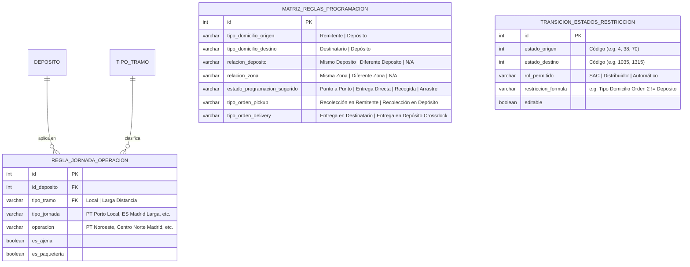
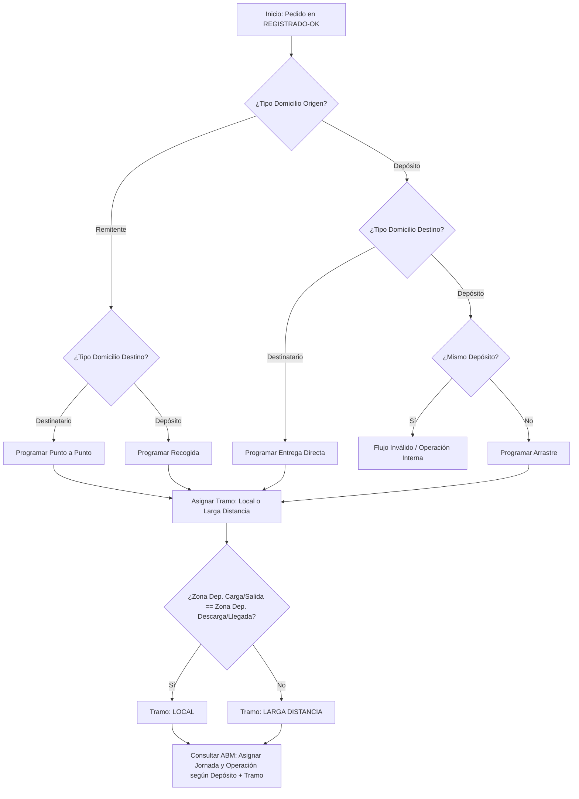
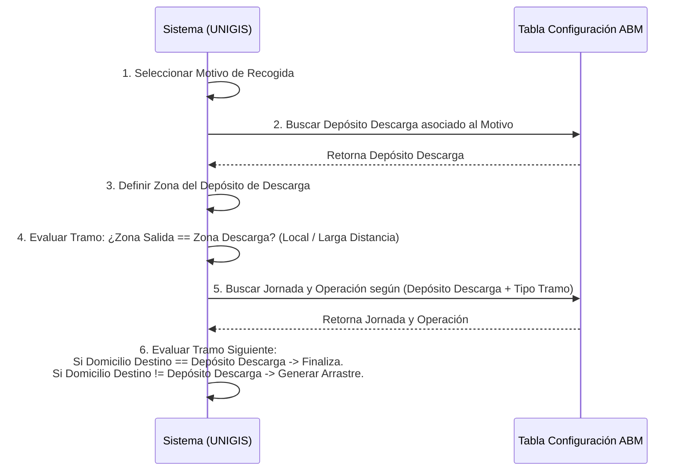
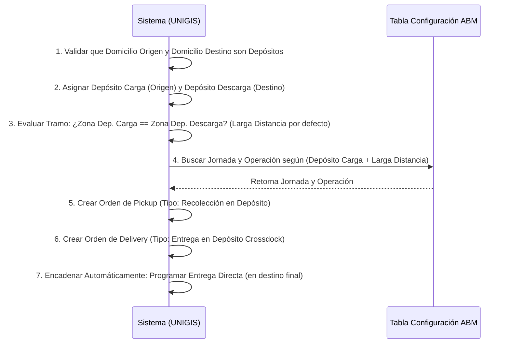
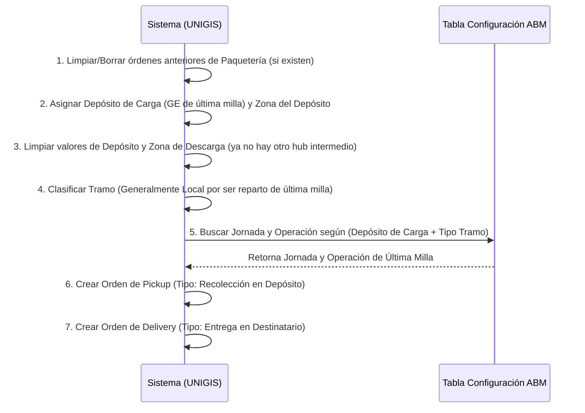

# 🗺️ Luis Simoes (LS) - Diseño de ABM y Relaciones de Programación TMS

Este documento detalla el diseño relacional y los flujos de decisión lógica basados en el archivo **`Programacion TMS.xlsx`** para el entorno de **LUIS SIMOES (LS)**. Su objetivo es servir como especificación técnica y visual para el desarrollo de un módulo de administración (ABM/CRUD) en UNIGIS que permita configurar estas asociaciones de manera dinámica.

---

## 1. Modelo de Datos del ABM (Diagrama Entidad-Relación)

Para poder configurar las reglas de negocio del Excel mediante una interfaz de ABM, se propone el siguiente modelo relacional de base de datos. Este modelo permite desligar las reglas de jornada, operación y tramo del código fuente, haciéndolas 100% configurables por el equipo de SAC y Administración.



---

## 2. Árbol de Decisión: Determinación del Flujo de Programación

Cuando un pedido es integrado en UNIGIS en estado **`4 (REGISTRADO-OK)`**, el motor de reglas debe evaluar las propiedades de los domicilios de origen y destino para auto-asignar el **Estado de Programación** correspondiente.

El siguiente diagrama ilustra el flujo de decisión que debe implementar el desarrollo en UNIGIS:



---

## 3. Flujos de Trabajo Paso a Paso por Estado

Basado en la pestaña **`Flujos estados`**, aquí se detallan visualmente las secuencias de acciones que el sistema debe ejecutar al cambiar a cada estado operativo:

### 3.1 Programar Recogida

Este flujo representa la recolección desde un cliente remitente hacia un hub o depósito propio (COL) para su posterior consolidación.



### 3.2 Programar Arrastre (Troncal / Crossdock)

Representa el movimiento troncal de mercancías entre dos depósitos o delegaciones de Luis Simoes.



### 3.3 Programar Entrega Directa

Representa el tramo final de reparto desde el depósito de descarga (GE) hacia el cliente destinatario final.



---

## 4. Prompts Preparados para Generación Adicional con Claude

Si necesitas trasladar esta especificación a Claude para generar el código SQL de creación de las tablas, la API en C#/.NET para el ABM en UNIGIS, o el esquema JSON de configuración, puedes utilizar el siguiente prompt:

### 📋 Prompt para Generación de Código SQL / API (Copiar y Pegar en Claude)
```text
Actúa como un Arquitecto de Software y Desarrollador Senior de UNIGIS TMS. 
Necesito crear un desarrollo a medida (ABM) para gestionar la lógica de asignación de jornadas, operaciones y transiciones en la operación de Luis Simoes (LS). 

Basándote en la siguiente especificación relacional:
1. Tabla REGLA_JORNADA_OPERACION: Asocia Depósito + Tipo Tramo (Local/Larga Distancia) a un Tipo de Jornada y Operación.
2. Tabla MATRIZ_REGLAS_PROGRAMACION: Mapea (Tipo Domicilio Origen, Tipo Domicilio Destino, Relación de Depósitos y Zonas) a un Estado de Programación sugerido y tipos de órdenes Pickup/Delivery.
3. Tabla TRANSICION_ESTADOS_RESTRICCION: Define qué roles pueden cambiar estados de pedidos y bajo qué fórmulas restrictivas.

Por favor, genera:
- Los scripts de creación de tablas en SQL Server, incluyendo índices de búsqueda para optimizar las consultas por Deposito y Tipo Tramo.
- Los modelos de entidad correspondientes en C# (.NET Core / Entity Framework) para mapear estas tablas.
- Un controlador Web API en C# que exponga los endpoints CRUD de estos ABM con validaciones básicas.
- El procedimiento almacenado (SP) 'Z_ResolverProgramacionPedido' que reciba un IdPedido, evalúe la matriz de decisión y actualice el EstadoPedido, el Tipo Jornada y la Operación del tramo correspondiente utilizando las tablas del ABM.
```
