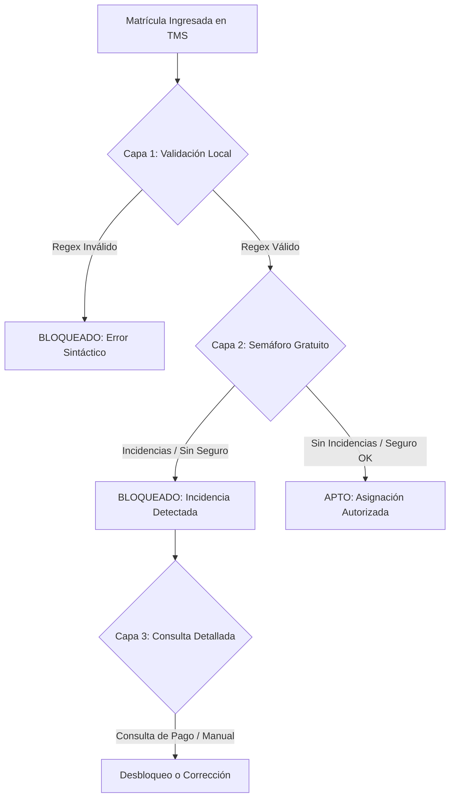

# Proyecto de Validación de Matrículas (ESP - POR - ITA)
## Documento de Justificación de Negocio y Especificación Técnica

**Fecha:** 9 de junio de 2026  
**Autor:** Antigravity (Advanced Agentic Coding - Google DeepMind)  
**Estado:** Propuesta Técnica / En Revisión  

---

## 1. Justificación de Negocio (¿Por qué es necesario el desarrollo?)

La asignación e ingreso de vehículos en un sistema de gestión de transporte (TMS) como UNIGIS conlleva riesgos regulatorios, operativos y comerciales críticos si las matrículas no se validan en tiempo real. Este desarrollo implementa una capa de validación local (sintáctica) y gubernamental (estado legal) para mitigar los siguientes puntos de dolor:

### 1.1. Cumplimiento Legal y Prevención de Sanciones
* **ITV/Revisiones Caducadas:** Circular con la inspección técnica vencida supone multas severas de tráfico y la inmovilización inmediata del vehículo. El TMS debe bloquear preventivamente la asignación de estas unidades.
* **Falta de Seguro Obligatorio:** En caso de siniestro, si el vehículo carece de seguro activo, la responsabilidad subsidiaria puede recaer sobre el cargador (dador de carga) además de anular las pólizas de cobertura de mercancías.

### 1.2. Continuidad de la Operación (Bloqueos en Centros de Carga)
* **Acceso Denegado a Almacenes (CD):** Clientes de gran envergadura (ej. centros de picking de Europastry como `L02` u otros operadores logísticos) validan las matrículas en la entrada. Un camión con documentación vencida o matrícula errónea es rechazado en los muelles de carga, lo que genera retrasos masivos en las entregas, pérdida de ventanas horarias (*slots*) y costes de estancia.
* **Lectura Automática (OCR) y Portuaria:** En operaciones que integran puertos o terminales (ej. tráficos de Mertramar en Algeciras y Sevilla), el acceso está automatizado mediante cámaras OCR. Si la matrícula en UNIGIS tiene una sola letra errónea por un fallo de transcripción, las barreras no se abrirán, paralizando el flujo intermodal.

### 1.3. Seguridad y Calidad del Dato
* **Prevención de Errores de Transcripción:** Previene que los transportistas o administrativos introduzcan caracteres inválidos (ej. la letra `I` o la `O` en Italia, que son inexistentes por ley para evitar confusión con números).
* **Mitigación del Fraude:** Al contrastar con las bases de datos de bajas gubernamentales (especialmente en Portugal e Italia), se evita la asignación de carga a matrículas robadas, dobladas o dadas de baja temporal.

---

## 2. Arquitectura General del Semáforo de Control en UNIGIS

Para optimizar los costes de consulta (evitando el pago innecesario de tasas de informes completos), se propone una arquitectura de **Semáforo en Tres Capas**:



---

## 3. Especificación Detallada por Países

---

### 🇪🇸 ESPAÑA (ESP)

El control en España se fundamenta en la integración oficial con la **DGT (Dirección General de Tráfico)** utilizando servicios B2B autorizados para grandes corporaciones o colaboradores sociales.

#### 3.1. Algoritmo y Flujo de Integración
La DGT permite realizar una consulta escalonada. Antes de realizar cualquier gasto, el sistema solicita un **Informe Reducido**.

1. **Consulta del Informe Reducido (Gratuito):**
   * **Requisitos:** Certificado digital de persona jurídica (firmado por la plataforma `@firma` del Gobierno) y alta como Colaborador en la Sede Electrónica de la DGT.
   * **Protocolo:** SOAP (XML) sobre HTTPS utilizando el WSDL oficial provisto por la DGT.
   * **Resultado de la DGT:** Devuelve un estado booleano simple:
     * 🟢 **"Sin Incidencias":** El vehículo tiene ITV vigente, seguro activo y no tiene precintos ni embargos que impidan circular. UNIGIS aprueba la asignación del viaje inmediatamente.
     * 🔴 **"Con Incidencias":** Indica que existe un impedimento legal (ITV caducada, falta de seguro, embargo, baja temporal). UNIGIS bloquea de inmediato la asignación de la orden/viaje al camión.

2. **Consulta del Informe Completo (De Pago / Opcional):**
   * **Coste:** Compra de tasas de la DGT (Tasa 4.1, valor aproximado de ~8.67 €). Se adquieren en lotes virtuales vinculados al certificado digital.
   * **Uso en UNIGIS:** Si el vehículo da "Con Incidencias" y el transportista insiste en que está al día, el gestor de tráfico puede solicitar (con descuento automático de tasa) el informe detallado para ver la fecha exacta de vencimiento de la ITV o el tipo de embargo.

#### 3.2. Implementación en Pseudocódigo (Python)
```python
import zeep # Biblioteca SOAP estándar de Python

def validar_camion_espana(matricula, cert_path, key_path):
    # Endpoint oficial de la DGT (WSDL privado entregado tras alta)
    wsdl_url = "https://sede.dgt.gob.es/WS_ConsultaVehiculos?wsdl"
    
    try:
        # Conexión segura con Certificado Digital admitido por @firma
        client = zeep.Client(
            wsdl=wsdl_url,
            transport=zeep.Transport(client=None, timeout=10)
        )
        # Se asume el uso de firma HTTPS mutua (mTLS) con el certificado
        
        # Llamar al servicio gratuito de Informe Reducido
        respuesta = client.service.solicitarInformeReducido(matricula=matricula)
        
        if respuesta.resultado == "SIN INCIDENCIAS":
            return {
                "status": "APTO",
                "mensaje": "Vehículo autorizado para circular (ITV y Seguro OK)",
                "bloquear_tms": False
            }
        elif respuesta.resultado == "CON INCIDENCIAS":
            return {
                "status": "BLOQUEADO",
                "mensaje": "Vehículo con incidencias legales en DGT. Requiere revisión manual.",
                "bloquear_tms": True,
                "accion_sugerida": "Solicitar Informe Completo (Tasa DGT 4.1)"
            }
        else:
            return {
                "status": "ERROR",
                "mensaje": "Matrícula no encontrada en el registro de la DGT.",
                "bloquear_tms": True
            }
    except Exception as e:
        # Fallback de seguridad en caso de caída del webservice de la DGT
        return {
            "status": "APTO_FALLBACK",
            "mensaje": f"No se pudo conectar con la DGT. Fallback activo: {str(e)}",
            "bloquear_tms": False
        }
```

---

### 🇵🇹 PORTUGAL (POR)

El control en Portugal presenta dos retos: la coexistencia de cuatro formatos de matrícula oficiales y la ausencia de un webservice público directo y abierto del **IMT (Instituto da Mobilidade e dos Transportes)** para consulta masiva privada.

#### 3.1. Algoritmo de Validación Local (Regex Multi-Formato)
Para evitar llamadas a servidores externos con formatos incorrectos, se aplica un Regex unificado. Portugal no discrimina letras (acepta de la A a la Z, incluyendo K, Y, W) y se estructura en bloques de dos caracteres separados por guiones.

Formatos vigentes:
1. **Formatos Antiguos (Previos a 2020):** `AA-00-00`, `00-AA-00` o `00-00-AA`.
2. **Formato Actual (Desde Marzo 2020):** `AA-00-AA`.

* **Regex Unificado:**
  `^(?:[A-Z]{2}-\d{2}-\d{2}|\d{2}-[A-Z]{2}-\d{2}|\d{2}-\d{2}-[A-Z]{2}|[A-Z]{2}-\d{2}-[A-Z]{2})$`

#### 3.2. Estrategia de Consulta Gubernamental (Bypass IMT)
Dado que el IMT no tiene un API REST estándar abierto para el sector logístico privado, se proponen tres alternativas de integración para el semáforo del TMS:

1. **Verificación de Seguro Activo via ASF (Gratuito/Scraping):**
   La **ASF (Autoridade de Supervisão de Seguros e Fundos de Pensões)** ofrece consulta pública para verificar si un vehículo tiene póliza activa. Si la matrícula no tiene póliza en la ASF, UNIGIS bloquea la orden.
2. **Base de Datos de Matrículas Canceladas del IMT (Gratuito):**
   El IMT publica un portal de consulta de matrículas que han sido dadas de baja o canceladas de forma definitiva. UNIGIS puede programar un *cronjob* diario para descargar la lista o realizar consultas web directas estructuradas.
3. **Pasarela Multi-País Centralizada (Recomendado para Producción):**
   Integración con proveedores privados europeos de datos de automoción (ej. **RegCheck / Eurotax**, **CarVertical B2B** o **Infocar**). Estos proveedores ofrecen un API REST unificada en formato JSON que devuelve el estado de ITV y seguros de Portugal y España con una única llamada.

#### 3.3. Implementación en Python
```python
import re

def validar_matricula_portugal(matricula_raw):
    # 1. Limpieza y estandarización a formato XX-XX-XX
    clean = matricula_raw.upper().replace(" ", "").replace("-", "")
    if len(clean) != 6:
        return False, "Longitud inválida para matrícula portuguesa"
        
    formatted = f"{clean[0:2]}-{clean[2:4]}-{clean[4:6]}"
    
    # 2. Regex que cubre los 4 formatos históricos y el actual de 2020
    patron = re.compile(
        r"^(?:"
        r"[A-Z]{2}-\d{2}-\d{2}|"  # AA-00-00
        r"\d{2}-[A-Z]{2}-\d{2}|"  # 00-AA-00
        r"\d{2}-\d{2}-[A-Z]{2}|"  # 00-00-AA
        r"[A-Z]{2}-\d{2}-[A-Z]{2}" # AA-00-AA (Actual)
        r")$"
    )
    
    es_valida = bool(patron.match(formatted))
    return es_valida, formatted if es_valida else "Formato incorrecto"
```

---

### 🇮🇹 ITALIA (ITA)

El sistema de validación italiano destaca por tener restricciones estrictas sobre qué letras se pueden utilizar en las matrículas para evitar errores de reconocimiento óptico de caracteres (OCR).

#### 3.1. Restricción de Caracteres y RegEx
Las matrículas italianas actuales (vigentes desde 1994) utilizan el formato secuencial `LL NNN LL` (2 letras, 3 números, 2 letras; por ejemplo: `AA 123 AA`). 

* **Restricción Crítica:** Para evitar confusión en la lectura visual y de sistemas automáticos OCR, la legislación italiana **prohíbe el uso de 4 letras**:
  * **Prohibidas:** `I`, `O`, `Q`, `U` (por su similitud gráfica con los números `1`, `0`, `0` y la letra `V` respectivamente).
  * **Permitidas:** Las restantes 22 letras del alfabeto.
* **Regex Unificado:**
  `^[A-HJ-NP-TV-Z]{2}\d{3}[A-HJ-NP-TV-Z]{2}$`

*Nota: Los remolques antiguos (anteriores a 2013) llevaban matrículas especiales que empezaban por la palabra entera "RIMORCHIO" o por las letras "XA". Si el transportista local opera flotas muy antiguas, se puede ampliar la Regex para dar soporte a estos casos especiales.*

#### 3.2. Flujo de Consulta Gubernamental
La gestión de vehículos en Italia está dividida entre el **MIT (Ministero delle Infrastrutture e dei Trasporti)** y el **ACI (Automobile Club d'Italia)** que gestiona el **PRA (Pubblico Registro Automobilistico)**.

1. **Vía A: El "Semáforo Gratuito" (Vía "Il Portale dell'Automobilista")**
   El Ministerio de Transportes de Italia ofrece consulta pública gratuita a través de su portal oficial para verificar:
   * **Verifica Copertura Assicurativa (Seguro):** Indica si el seguro está activo.
   * **Verifica Ultima Revisione (ITV):** Devuelve la fecha de la última inspección realizada y los kilómetros registrados.
   * **Integración:** UNIGIS se conecta al endpoint de `Servizi de Cooperazione Applicativa` (REST/SOAP). Si el seguro está inactivo o la *revisione* (ITV) vencida, el TMS bloquea la expedición del camión.

2. **Vía B: Integración con el PRA (Propiedad y Cargas)**
   Para comprobar si el camión tiene embargos financieros o problemas de propiedad en Italia, se requiere consultar al **PRA (ACI)** mediante la API de *Visure Telematiche*. Esta consulta tiene coste por tasa (~6.00 € a ~9.00 €).

#### 3.3. Implementación en Python
```python
import re

def validar_matricula_italia(matricula_raw):
    # 1. Limpieza estándar
    clean = matricula_raw.upper().replace(" ", "").replace("-", "")
    
    # 2. Exclusión de letras I, O, Q, U
    # Formato: 2 letras válidas, 3 dígitos, 2 letras válidas
    patron = re.compile(r"^[A-HJ-NP-TV-Z]{2}\d{3}[A-HJ-NP-TV-Z]{2}$")
    
    es_valida = bool(patron.match(clean))
    return es_valida, clean if es_valida else "Contiene caracteres prohibidos (I, O, Q, U) o formato inválido"
```

---

## 4. Integración Propuesta en la Base de Datos de UNIGIS

Para dar soporte a estas validaciones sin degradar el rendimiento de la planificación de rutas, se recomienda agregar los siguientes campos a la tabla de **Vehiculo** en la base de datos de UNIGIS:

```sql
ALTER TABLE Vehiculo ADD 
    ValidaMatricula BIT DEFAULT 0,
    UltimaValidacionFecha DATETIME NULL,
    EstadoValidacion VARCHAR(20) DEFAULT 'PENDIENTE', -- PENDIENTE, APTO, BLOQUEADO, ERROR
    MotivoBloqueo VARCHAR(256) NULL,
    SeguroVenceFecha DATE NULL,
    ITVVenceFecha DATE NULL;
```

### Regla de Negocio sugerida en el Planificador (Asignador de Viajes):
```sql
-- Query conceptual que corre el planificador de UNIGIS antes de asignar un vehículo a un viaje
SELECT IdVehiculo, Dominio 
FROM Vehiculo 
WHERE IdVehiculo = @IdVehiculo
  AND EstadoValidacion <> 'BLOQUEADO' -- Evita asignar camiones bloqueados por ITV o Seguro
  AND (ITVVenceFecha IS NULL OR ITVVenceFecha >= GETDATE())
  AND (SeguroVenceFecha IS NULL OR SeguroVenceFecha >= GETDATE());
```

---

## 5. Conclusión y Recomendación de Implementación

1. **Validación Sintáctica Obligatoria (Capa 1):** Implementar de forma inmediata los validadores locales (RegEx) en el campo `Dominio` del formulario de Vehículo en UNIGIS Fleet y en las APIs de carga de transportistas. Esto detiene el 95% de los fallos por errores tipográficos antes de guardar el registro en base de datos.
2. **Pasarela Centralizada (Recomendado):** Para evitar mantener múltiples desarrollos SOAP/REST con organismos públicos de tres países que cambian con frecuencia sus políticas de seguridad (DGT, IMT, ACI), la opción óptima para UNIGIS en producción es subcontratar el servicio a una pasarela europea unificada de datos de automoción (ej. RegCheck o CarVertical). Esto unifica el flujo en una única API REST estándar para los tres países.
